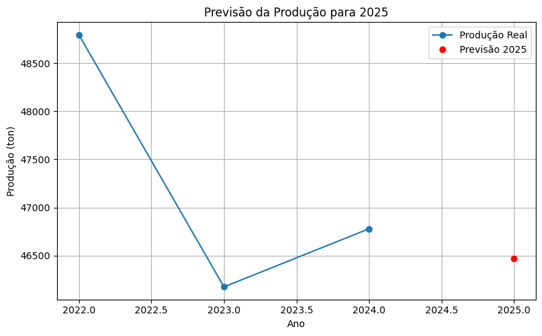
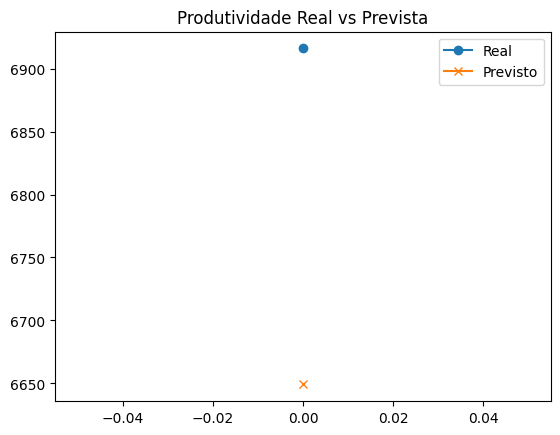

# FIAP - Faculdade de Informática e Administração Paulista

 

## Grupo 67

## 👨‍🎓 Integrantes: 
- <a href="https://www.linkedin.com/in/vittor-augusto/">Vitor Augusto Gomes</a>
- <a href="https://www.linkedin.com/company/inova-fusca">João Vitor Lopes Beiro</a>
- <a href="https://www.linkedin.com/company/inova-fusca">Thyego Brandão</a> 
- <a href="https://www.linkedin.com/company/inova-fusca">Lucas Gabriel Alves Costa</a> 
- <a href="https://www.linkedin.com/company/inova-fusca">Lucas Ferreira Hillesheim</a>

## 👩‍🏫 Professores:
### Tutor(a) 
- <a href="https://www.linkedin.com/in/leonardoorabona/">Leonardo Ruiz Orabona</a>
### Coordenador(a)
- <a href="https://www.linkedin.com/in/profandregodoi/">André Godoi Chiovato</a>

## 📜 Descrição

### Projeto Challenge Ingredion - Fase 2: 🌱 Previsão de Produção Agrícola com Regressão Linear ###
Este projeto tem como objetivo prever a produção agrícola em toneladas (ton) no Brasil utilizando dados públicos reais (da CONAB, MAPA e IBGE), com variáveis derivadas calculadas a partir dos dados brutos. Utilizamos Regressão Linear para fazer a previsão do valor para o ano de 2025.

### 📊 Dados Utilizados ###
Os dados foram coletados de fontes públicas confiáveis como:

-CONAB - Companhia Nacional de Abastecimento

-MAPA - Ministério da Agricultura, Pecuária e Abastecimento

-IBGE - Instituto Brasileiro de Geografia e Estatística

O arquivo base (dados_produtividade.csv) contém as colunas:

-Ano

-Produção (ton)

-Área Plantada (ha)

-Produtividade (kg/ha)

-Fonte

### 🧪 Processamento de Dados ###
Foram realizadas as seguintes etapas de tratamento:

1. Conversão dos valores numéricos para float, substituindo vírgulas por pontos.
2. Remoção de valores ausentes (NaN).
3. Criação de variáveis derivadas:

python
 
*Produtividade estimada com base na produção e área plantada*

df_derived['Produtividade Calculada'] = (df_derived['Produção (ton)'] * 1000) / df_derived['Área Plantada (ha)']

*Variação percentual da produtividade entre os anos*

df_derived['Variação Produtividade (%)'] = df_derived['Produtividade Calculada'].pct_change() * 100

*Densidade de produção (ton/ha)*

df_derived['Densidade de Produção (ton/ha)'] = df_derived['Produção (ton)'] / df_derived['Área Plantada (ha)']

### 🤖 Modelo de Previsão ###
Utilizamos Regressão Linear com a biblioteca scikit-learn. As variáveis preditoras foram:

-Ano
-Área Plantada (ha)
-Produtividade Calculada
-Variação Produtividade (%)
-Densidade de Produção (ton/ha)

O modelo foi treinado com todos os dados históricos e utilizou a média das variáveis para realizar a previsão de 2025.

python

from sklearn.linear_model import LinearRegression

modelo = LinearRegression()
modelo.fit(X, y)

previsao_2025 = modelo.predict(dados_2025)[0]

### 📈 Resultado da Previsão ###

✅ A previsão de produção para 2025 foi:

46438.50 toneladas

### 🖼️ Gráfico da Previsão ###

### Códigos Google Collab ###

Os códigos/scrpits utilizados no Google Collab se encontram em */Códigos Collab.ipynb* na pasta raíz.

### 💾 Exportação Final ###

O DataFrame com os dados reais e a linha da previsão de 2025 foi exportado para:

(document/dados_com_previsao_2025.csv)

Você pode abrir o arquivo em Excel, LibreOffice, ou outro sistema para visualizar e usar os dados.

### 🛠️ Tecnologias e Bibliotecas ###

* Python 3.x
* pandas
* numpy
* scikit-learn
* matplotlib

### 🚀 Como Executar ###

1. Instale as bibliotecas com pip install pandas scikit-learn matplotlib.

2. Coloque o arquivo dados_produtividade.csv na mesma pasta do script Python.

3. Execute o script para treinar o modelo e gerar o gráfico.

4. O arquivo previsao_2025_final.csv será gerado automaticamente.

### 📌 Observações ###

* O valor para 2025 é uma estimativa com base nas médias históricas.

* A precisão depende da qualidade e quantidade dos dados disponíveis.

## 📁 Estrutura de pastas

Dentre os arquivos e pastas presentes na raiz do projeto, definem-se:

- <b>.github</b>: Nesta pasta ficarão os arquivos de configuração específicos do GitHub que ajudam a gerenciar e automatizar processos no repositório.

- <b>assets</b>: aqui estão os arquivos relacionados a elementos não-estruturados deste repositório, como imagens.

- <b>config</b>: Posicione aqui arquivos de configuração que são usados para definir parâmetros e ajustes do projeto.

- <b>document</b>: aqui estão todos os documentos do projeto que as atividades poderão pedir. Na subpasta "other", adicione documentos complementares e menos importantes.

- <b>scripts</b>: Posicione aqui scripts auxiliares para tarefas específicas do seu projeto. Exemplo: deploy, migrações de banco de dados, backups.

- <b>src</b>: Todo o código fonte criado para o desenvolvimento do projeto ao longo das 7 fases.

- <b>README.md</b>: arquivo que serve como guia e explicação geral sobre o projeto (o mesmo que você está lendo agora).

## 📋 Licença

<a property="dct:title" rel="cc:attributionURL" href="https://github.com/agodoi/template">MODELO GIT FIAP</a> por <a rel="cc:attributionURL dct:creator" property="cc:attributionName" href="https://fiap.com.br">Fiap</a> está licenciado sobre <a href="http://creativecommons.org/licenses/by/4.0/?ref=chooser-v1" target="_blank" rel="license noopener noreferrer" style="display:inline-block;">Attribution 4.0 International</a>.

